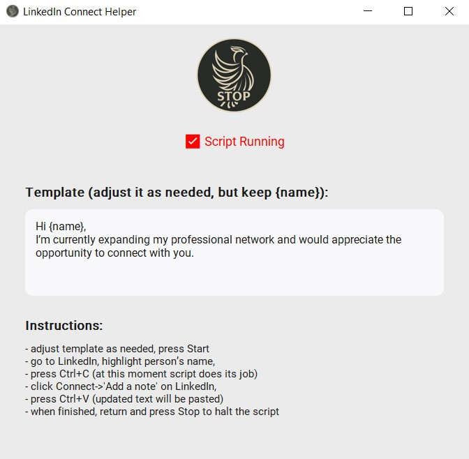

# LinkedIn Connect Helper

A lightweight desktop tool to speed up sending connection messages on LinkedIn.

## 💡 Description and features
- It simply wrap text from your clipboard with a template message
- Clipboard-triggered: copy someone's name → message is ready to paste
- Minimal and intuitive GUI
- Template auto-saved on closing between sessions into hidden "li_helper_cache.txt" in the same directory
- Built with Python + CustomTkinter

## 🖼️ Interface



## To run install dependencies

```bash
pip install -r requirements.txt
```

## Portable exe generation:
```
pyinstaller --onefile --windowed ^
  --icon=logo_circle.ico ^
  --add-data "logo_circle.ico;." ^
  --add-data "logo_start_400.png;." ^
  --add-data "logo_stop_400.png;." ^
  linkedin_helper_gui.py```
